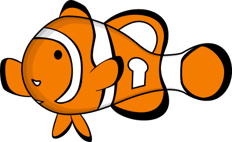

Tracking the progress of [OMEMO](https://conversations.im/omemo/)
integration in various XMPP clients.

# Client Progress

<table id="clients">
  <thead>
    <tr>
      <th data-sort-default><strong>Client</strong></th>
      <th>Tracking Issue</th>
      <th>Bounty</th>
      <th id="progressHeader">Progress</th>
    </tr>
  </thead>



  <tr>
    <td><a href="{{ client.url }}" alt="{{ client.name }} website">{{ client.name }}</a></td>
    <td>
      
      <a href="{{ client.tracking_issue }}">✪</a>
      😢
    </td>
    <td>
      
      
      
    </td>

    <td data-sort="{{ client.status | plus: 0 }}" class="progress">
      <progress max="100" value="{{ client.status | plus: 0 }}"></progress>
    </td>
  </tr>
  
</table>

#### Alternative OMEMO Plugins

* Anderchat, Spark, Jitsi, Kontalk, Xabber and Zom can use [Smack](https://igniterealtime.org/projects/smack/index.jsp) [#743](https://issues.igniterealtime.org/browse/SMACK-743) 
* Empathy has a separate upstream issue open at [Telepathy](https://telepathy.freedesktop.org/): [#93090](https://bugs.freedesktop.org/show_bug.cgi?id=93090) 
* Pidgin has an alternative Plugin named [lurch](https://github.com/gkdr/lurch).

### Have something to add / update?

Please send a [pull request](https://github.com/bascht/omemo-top).

---

A project by [@renevolution](https://github.com/renevolution)
and [@bascht](https://github.com/bascht).

